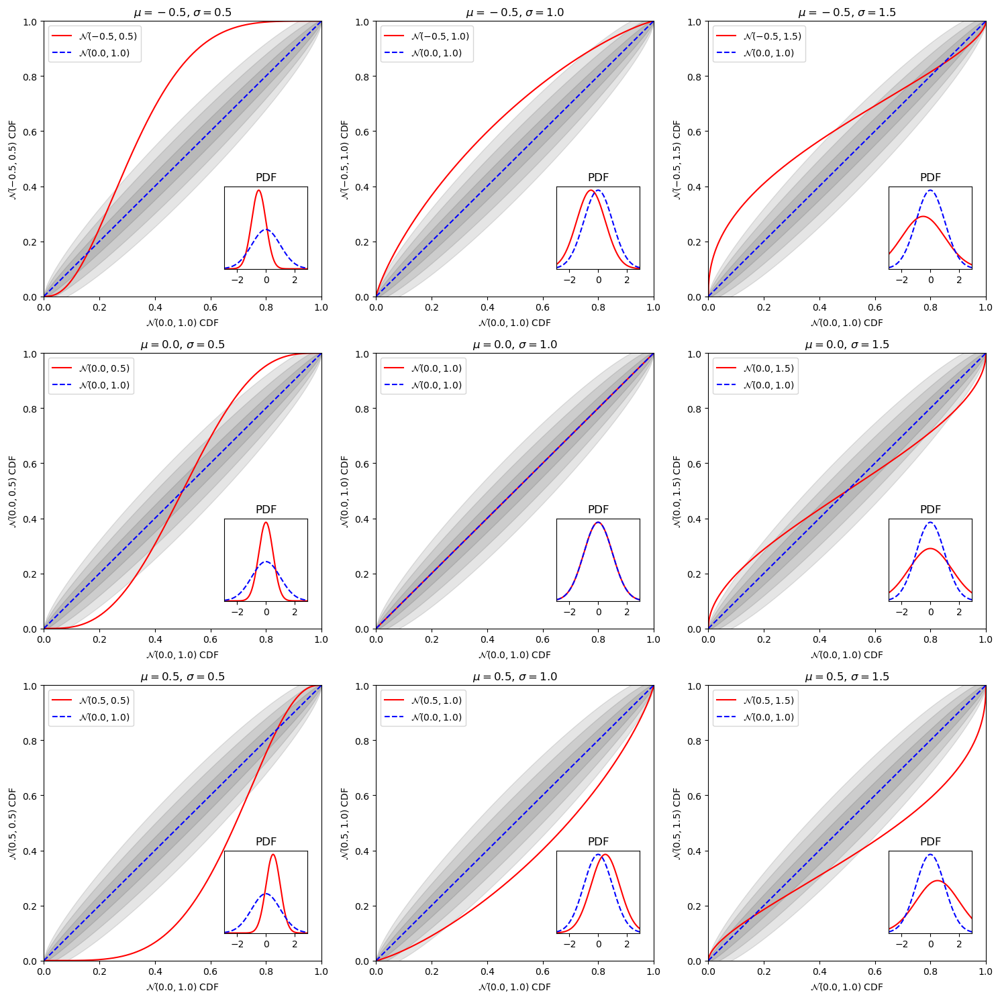

```python
# Title: P-P plots explanation
# Date: 2023-06-06
# Categories: Bayesian-statistics p-p-plots
```


```python
import numpy as np
from scipy.stats import norm
import matplotlib.pyplot as plt
import matplotlib as mpl

```


```python
Nsamples = 100_000
muvals = np.array([-0.5, 0.0, 0.5])
sigvals = np.array([0.5, 1.0, 1.5])

nrows = ncols = len(muvals)

fig, ax = plt.subplots(nrows=nrows, ncols=ncols, figsize=(ncols*5, nrows*5))

pdf_ref = norm(loc=0.0, scale=1.0) # Reference dist

for ii_row, mu in enumerate(muvals):
    for ii_col, sigma in enumerate(sigvals):

        pdf_trans = norm(loc=mu, scale=sigma)   # Transformed dist

        pvals = pdf_trans.cdf(pdf_ref.ppf(np.linspace(0, 1, 1000)))
        q = np.linspace(0, 1, len(pvals))
        q_sig = np.sqrt(q * (1-q) / 100)

        ax[ii_row, ii_col].plot(q, pvals, '-', c='r', label='$\mathcal{N}' f'({mu},{sigma})$')
        ax[ii_row, ii_col].plot(q, q, '--', c='b', label='$\mathcal{N}(0.0,1.0)$')
        ax[ii_row, ii_col].set_title("$\mu" f"={mu}$, " "$\sigma" f"={sigma}$")
        ax[ii_row, ii_col].fill_between(q, q-q_sig, q+q_sig, color='k', alpha=0.1)
        ax[ii_row, ii_col].fill_between(q, q-2*q_sig, q+2*q_sig, color='k', alpha=0.1)
        ax[ii_row, ii_col].fill_between(q, q-3*q_sig, q+3*q_sig, color='k', alpha=0.1)
        ax[ii_row, ii_col].set_xlabel('$\mathcal{N}(0.0,1.0)$ CDF', fontsize=10)
        ax[ii_row, ii_col].set_ylabel('$\mathcal{N}' f'({mu},{sigma})$ CDF', fontsize=10)
        ax[ii_row, ii_col].set_xlim([0, 1])
        ax[ii_row, ii_col].set_ylim([0, 1])
        ax[ii_row, ii_col].legend()
        
        xx = np.linspace(-2.9, 2.9, 1000)
        yy_ref = pdf_ref.pdf(xx)
        yy_trans = pdf_trans.pdf(xx)
        
        ax_ins = ax[ii_row, ii_col].inset_axes([0.65,0.1,0.3,0.3])

        ax_ins.plot(xx, yy_trans, '-', c='r')
        ax_ins.plot(xx, yy_ref, '--', c='b')
        
        ax_ins.set_xlim([-2.9, 2.9])
        ax_ins.set_ylim([0, max(np.max(yy_ref), np.max(yy_trans))*1.05])
        ax_ins.set_xticks([-2.0, 0.0, 2.0])
        ax_ins.set_yticks([])
        ax_ins.set_title("PDF")

fig.tight_layout()
#fig.savefig('p-p-plot-explanation_light.png', dpi=300)
#fig.savefig('p-p-plot-explanation_light.pdf', dpi=300)
```


    

    


```python
plt.style.use('dark_background')
mpl.rcParams['figure.figsize'] = [20.0, 7.0]
```


```python

```
